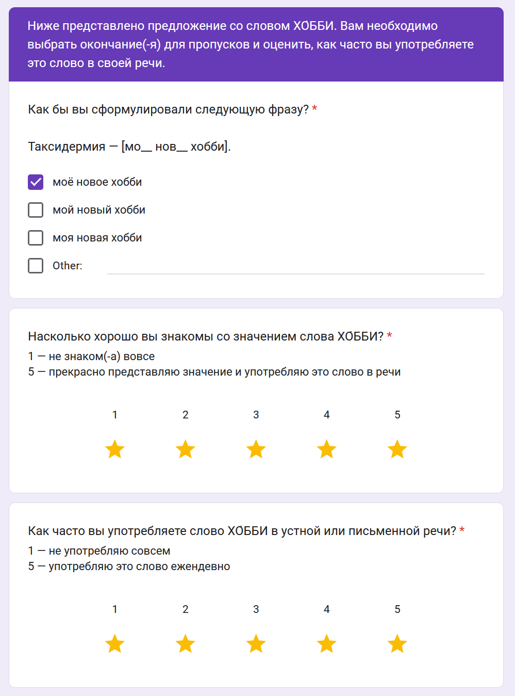

---
output:
  html_document: default
  pdf_document: 
    latex_engine: pdflatex
header-includes:
  - \usepackage[utf8]{inputenc}
  - \usepackage[T2A]{fontenc} 
  - \usepackage[russian]{babel}
bibliography: bibliography_references.bib
csl: "gost-r-7-0-5-2008.csl"
---

# Варьирование несклоняемых существительных по грамматическому роду в русском языке

Очевидно, что разнообразие языков мира велико: они различаются фонетически, морфологически, синтаксически, лексически. По утверждению Александра Бердичевского [@1], с точки зрения грамматики, "языки отличаются значениями, которые они не могут не выразить". Например, в китайском языке между числительным и существительным обязательно должно употребляться, так называемое, счетное слово, или классификатор, который указывает, к какому классу относится существительное, например, 两 (два) 颗 (счетное слово для небольших округлых предметов) 牙齿 (зуб) – "два зуба", при этом в русском счетное мы не употребляем. И наоборот, в русском также есть категории, которые говорящий не может не выразить, при этом в других языках, в том числе китайском или английском, такого требования может не быть. К таким, например, мы можем отнести требование к выражению грамматического рода.

Однако что происходит со словом, заимствованным из языка, в котором требование к выражению грамматического рода отсутствует? Ю. Маслов утверждает, что при заимствовании слова из другого языка оно "включается в морфологическую систему заимствующего языка, получая соответствующие грамматические категории", приводя в пример слова "система" и "панорама", которые носители относят к женскому роду, так как эти слова оканчиваются на -а – то есть по принципу аналогии [@2].

Что касается несклоняемых существительных, А. Зализняк пишет: "Существуют следующие закономерности выбора такими существительными родовой характеристики: род зависит либо от значения слова, либо от рода другого русского слова, которое рассматривается как синоним или как родовое наименование для данного неизменяемого слова. Для разных групп существительных ведущими являются разные критерии. [...] Если существительное обозначает предмет, то оно обычно приобретает характеристику среднего рода: *пальто, кашне, метро*. Однако женского рода *авеню* (так как *улица*), *кольраби* (так как это *капуста*), *кофе* — с колебанием — мужской / средний, мужской род — *пенальти, евро*." [@3]

В данном исследовании проверяется предположение о том, что наделение несклоняемого существительного определенным грамматическим родом происходит на основе формального признака – конечного звука.

**Гипотеза**

H0: носители русского языка определяют грамматический род несклоняемых существительных на основе конечного звука.

H1: носители русского языка определяют грамматический род несклоняемых существительных на основе другой характеристики.

**Методы сбора данных**

В рамках исследования была составлена анкета, состоящая из 48 страниц, каждая из которых включала три блока: предложение, содержащее одно несклоняемое существительное с пропусками вместо окончаний в сопряженных с этим существительным словах; оценка респондентом понимания значения существительного и оценка частоты употребления существительного в речи респондента.

{width="450"}

В исследовании приняло участие 44 человека в основном из двух сфер - ИТ и лингвистика. Подробная описательная статистика приведена в соответствующем разделе.

**Материалы исследования**

Перечень несклоняемых существительных, включенных в исследование, можно разделить на 3 группы:

-   неологизмы (далее группа I)
-   заимствованные слова, зафиксированные в словарях, и употребляемые часто\* (далее группа II)
-   заимствованные слова, зафиксированные в словарях, и употребляемые нечасто\* (далее группа III)

\*слова для этих двух групп были отобраны на основе лингвистического опыта автора, а затем проверены в ходе анализа.

Для обнаружения неологизмов были собраны тексты с сайтов Яндекс.Путешествия, Wonderzine, habr, sobakaru, блога сервиса психологической помощи Ясно и интернет-журнала Blueprint. Тексты были токенизированы, и если токен не был найден в словаре opencorpora [@3], то он считался неологизмом. Далее, когда списки предположительных неологизмов были собраны, из них вручную выбирались несклоняемые заимствованные слова.

При этом важно, что для исследования отбирались слова, обозначающие предметы, а не лиц или животных. Полный список использованных существительных приведен в Приложении 2.

Все отобранные для исследования слова были размечены следующими признаками:

-   конечный звук
-   группа (см. выше)
-   грам. род по словарю (перечень словарей приведен в Приложении 2)
-   язык происхождения

**Методы анализа**

Для проверки гипотезы было выбрано три метода:

1)  тест Пирсона для двух переменных - грам. род - конечный звук, p-value=0.05. Тест Пирсона даст нам понять, есть ли связь между переменными.

2)  однофакторный ANOVA с повторными измерениями, чтобы сравнить средние значения энтропии между разными конечными звуками.

3)  дополнительный однофакторный ANOVA с повторными измерениями, чтобы сравнить средние значения энтропии между группами существительных.

## Данные

Для анализа использовалось два датасета: в первом хранятся ответы респондентов, во втором - характеристики существительных, участвовавших в исследовании.

Параметры листа `resp`:

-   `sex`: пол респондента ("женский"/"мужской")
-   `age`: возраст респондента
-   `languages`: языки, которыми владеет респондент
-   `it_related`: связан ли респондент со сферой ИТ ("да"/"нет")
-   `linguistics_related`: связан ли респондент со сферой лингвистики или филологии ("да"/"нет")
-   `{word}_sent`: грамматический род, к которому респондент отнес слово `{word}`
-   `{word}_meaning`: оценка того, насколько респондент знаком со значением слова
-   `{word}_freq`: оценка частоты употребления слова реапондентом

Параметры листа `words`:

-   `word`: существительное
-   `group`: группа существительных (I/II/III)
-   `gram_gender`: грамматический род по словарю (если слова нет в словаре, то "-")
-   `origin`: язык заимствования по словарю (если существительного нет в словаре, то указан предположительный язык со "звездочкой", например, "английский\*)
-   `last_letter`: конечный звук в существительном

## Описательная статистика респондентов

### Импорт библиотек

```{r include=FALSE}
if (!require("readxl")) install.packages("readxl")
if (!require("dplyr")) install.packages("dplyr")
if (!require("ggplot2")) install.packages("ggplot2")
if (!require("tidyverse")) install.packages("tidyverse")
if (!require("effectsize")) install.packages("effectsize")
if (!require("entropy")) install.packages("entropy")
if (!require("patchwork")) install.packages("patchwork")
if (!require("rstatix")) install.packages("rstatix")
if (!require("PMCMRplus")) install.packages("PMCMRplus")
```

```{r include=FALSE}
library(readxl)
library(dplyr)
library(ggplot2)
library(tidyverse)
library(effectsize)
options(es.use_symbols = TRUE)
library(entropy)
library(patchwork)
library(rstatix)
library(PMCMRplus)
```

```{r eval=FALSE, include=FALSE}
blank_theme <- theme_minimal()+
  theme(
  axis.title.x = element_blank(),
  axis.title.y = element_blank(),
  panel.border = element_blank(),
  panel.grid=element_blank(),
  axis.ticks = element_blank(),
  plot.title=element_text(size=14, face="bold")
  )
```

### Загрузка данных о респондентах

```{r}
# перечисляем столбцы, которые мы хотим прочитать
col_list = c("sex", "age", "languages", "it_related", "linguistics_related")

# читаем данные из эксель с листа resp
df <- readxl::read_excel('Анкета респондента (Responses)_42.xlsx', sheet = 'resp')[col_list]
dplyr::glimpse(df)
```

```{r}
# смотрим на краткую сводку по данным
df <- df %>% mutate(across(c("sex", "it_related", "linguistics_related"), as.factor))
summary(df)
```

```{r eval=FALSE, include=FALSE}
df_stats <- df %>%
  group_by(sex) %>%
  summarise(across(age, list(min=min, Q1=~quantile(., probs = 0.25),
                    median=median, Q3=~quantile(., probs = 0.75),
                    max=max),  .names = "{.fn}")) %>% as.list

# c(df_stats$min, df_stats$max, df_stats$median, as.list(df_stats$Q1)$"25%", as.list(df_stats$Q1)$"75%")
c(df_stats$min, df_stats$max)
```

```{r}
# функция для форматирования дробей в проценты
percent <- function(x, digits = 2, format = "f", ...) {
  paste0(formatC(100 * x, format = format, digits = digits, ...), "%")
}
```

### Визуализации

#### Пол участников

```{r, fig.width=4, fig.height=4}
# визуализируем распределение по полу
df %>%
  group_by(sex) %>%
  summarise(count=n())  %>%
  arrange(count) %>%
  mutate(cumsum = cumsum(count)) %>%
  
  ggplot(aes(x="", y=count, fill=sex))+
  geom_bar(width = 0.4, stat = "identity") + 
  coord_polar("y", start=0) +
  
  theme(legend.position="bottom", legend.box = "horizontal") +
  guides(fill=guide_legend(title="Пол")) +
  geom_text(aes(y=c(10,30), hjust=0.5, vjust=0.5, label=percent(count/sum(count))),color="black",)+
  
  #geom_text(aes(y=cumsum, label=count), vjust=1.6, color="black")+
  scale_x_discrete(labels = NULL, breaks = NULL) + labs(x = NULL) +
  scale_y_continuous(name="Количество респондентов") +
  
  ggtitle("Пол респондентов") +
  theme(
  axis.title.x = element_blank(),
  axis.title.y = element_blank(),
  panel.border = element_blank(),
  panel.grid=element_blank(),
  axis.ticks = element_blank()
  ) +
  scale_fill_brewer(palette="Set3")
```

#### Возраст участников

```{r, fig.width=10, fig.height=4}
# визуализируем распределение по возрасту

# считаем количество ответов для каждого значения возраста
df_grouped <- df %>%
  group_by(age) %>%
  summarise(count=n())  %>%
  arrange(age)

# находим среднее и медианное значение возраста
df_stats <- df %>%
  summarize(mean_age = mean(age), median_age = median(age))

# визуализируем
df_grouped %>%
  ggplot(aes(x=age, y=count))+
  geom_bar(width = 0.8, stat = "identity") + 
  
  geom_vline(aes(xintercept = df_stats$mean_age), color='red', linetype='solid') +
  annotate(x = df_stats$mean_age, y = +Inf, label = "mean", hjust = 2,geom = "label", angle=90) +
  geom_vline(aes(xintercept = df_stats$median_age), color='red', linetype='dashed') +
  annotate(x = df_stats$median_age, y = +Inf, label = "median", hjust = 2,geom = "label", angle=90) +
  
  theme(legend.position="bottom", legend.box = "horizontal") +
  guides(fill=guide_legend(title="Пол")) +
  
  scale_x_continuous(name="Возраст",breaks=seq(0,100,1)) +
  scale_y_continuous(name="Количество респондентов",breaks=seq(0,100,1)) +
  
  ggtitle("Возраст респондентов") +
  scale_fill_brewer(palette="Set3")
```

#### Пол и возраст участников

```{r, fig.width=4, fig.height=6}
# визуализируем распределение по полу и возрасту

df %>%
  ggplot(aes(x=sex, y=age, fill=sex))+
  geom_boxplot() +
  
  geom_jitter(shape=16, position=position_jitter(0.3)) +
  
  theme(legend.position="bottom", legend.box = "horizontal") +
  guides(fill=guide_legend(title="Пол")) +
  
  scale_x_discrete(labels = NULL, breaks = NULL) + labs(x = NULL) +
  scale_y_continuous(name="Возраст", breaks=seq(0,100,3)) +
  
  ggtitle("Пол и возраст респондентов") +
  scale_fill_brewer(palette="Set3")
```

#### Сфера деятельности участников

```{r}
# создаем признак "сфера деятельности"
df <- df %>% mutate(sphere = case_when(
  it_related == "Да" & linguistics_related == "Да" ~ "ИТ+Лингв",
  it_related == "Да" ~ "ИТ",
  linguistics_related == "Да" ~ "Лингв",
  it_related == "Нет" & linguistics_related == "Нет" ~ "Другое"
)) 

# считаем количество ответов для каждого значения сферы деятельности
df_grouped <- df %>%
  group_by(sphere) %>%
  summarise(count=n())

# визуализируем
df_grouped %>%
  ggplot(aes(x=sphere, y=count, fill=sphere))+
  geom_bar(width = 0.8, stat = "identity") +
  
  geom_text(aes(y=count, hjust=0.5, vjust=0.5, label=percent(count/sum(count))),color="black",)+
  
  theme(legend.position="bottom", legend.box = "horizontal") +
  guides(fill=guide_legend(title="Сфера")) +
  
  scale_x_discrete(name="Сфера") +
  scale_y_continuous(name="Количество респондентов") +
  
  ggtitle("Сфера деятельности респондентов") +
  scale_fill_brewer(palette="Set3")
```

## Описательная статистика материалов исследования

### Загрузка данных о материалах исследования

```{r}
# читаем данные из эксель
df_words <- readxl::read_excel('Анкета респондента (Responses)_42.xlsx', sheet = 'words')
dplyr::glimpse(df_words)
```

```{r}
# смотрим на краткую сводку по данным
df_words <- df_words %>% mutate(across(c("group", "gram_gender", "origin", "last_letter"), as.factor))
summary(df_words)
```

### Визуализации

#### Конечные звуки существительных

```{r, fig.width=6, fig.height=4}
# конечный звук и группа

df_words %>%
  group_by(last_letter) %>%
  summarise(count=n())  %>%
  
  ggplot(aes(x=last_letter, y=count, fill=last_letter))+
  geom_bar(stat = "identity",position = position_dodge()) +
  
  geom_text(aes(y=count, hjust=0.5, vjust=0.5, label=count),color="black",) +
  
  scale_x_discrete(name="Конечный звук") +
  scale_y_continuous(name="Количество существительных") +
  
  guides(fill="none") +
  
  ggtitle("Конечные звуки существительных") +
  
  scale_fill_brewer(palette = "Set3") +
  scale_color_brewer(palette = "Set3")
```

#### Распределение существительных по группам

```{r, fig.width=6, fig.height=4}
# визуализируем распределение существительных по группам
df_words %>%
  group_by(group) %>%
  summarise(count=n())  %>%
  
  ggplot(aes(x="", y=count, fill=group))+
  geom_bar(width = 0.4, stat = "identity") + 
  coord_polar("y", start=0) +
  
  theme(legend.position="right") +
  guides(fill=guide_legend(title="Группа")) +
  
  geom_text(aes(y=c(40,10,25), hjust=0.5, vjust=0.5, label=percent(count/sum(count))),color="black",)+
  scale_x_discrete(name="Группа") +
  scale_y_continuous(name="none") +
  
  ggtitle("Распределение существительных по группам") +
  theme(
  axis.title.x = element_blank(),
  axis.title.y = element_blank(),
  panel.border = element_blank(),
  panel.grid=element_blank(),
  axis.ticks = element_blank()
  ) +
  scale_fill_brewer(palette="Set3")
```

#### Конечный звук и группа

```{r, fig.width=6, fig.height=4}
# конечный звук и группа

df_words %>%
  group_by(group, last_letter) %>%
  summarise(count=n())  %>%
  
  ggplot(aes(x=last_letter, y=count, fill=group))+
  geom_bar(stat = "identity",position = position_dodge()) +
  
  scale_x_discrete(name="Конечный звук") +
  scale_y_continuous(name="Количество существительных") +
  
  guides(fill=guide_legend(title="Группа")) +
  
  ggtitle("Группы существительных и конечные звуки") +
  
  scale_fill_brewer(palette = "Set3") +
  scale_color_brewer(palette = "Set3")
```

#### Распределение по грамматическим родам согласно словарю

```{r, fig.width=6, fig.height=4}
# визуализируем распределение по грамматическим родам
df_stats <- df_words %>%
  group_by(gram_gender) %>%
  summarise(count=n())  %>%
  arrange(desc(count)) %>%
  mutate(cumsum = cumsum(count)) 

level_order = as.character(df_stats$gram_gender)

df_stats %>%
  ggplot(aes(x=factor(gram_gender,level = level_order), y=count, fill=gram_gender, ))+
  geom_bar(width = 0.4, stat = "identity") + 
  
  theme(legend.position="none") +
  
  geom_text(aes(y=count, label=percent(count/sum(count))), vjust=1.6, color="black",)+
  scale_x_discrete(name="Грам. род по словарю") +
  scale_y_continuous(name="Количество существительных") +
  
  ggtitle("Распределение существительных по грамматическим родам") +
  scale_fill_brewer(palette="Set3")
```

#### Конечный звук и грам. род по словарю

```{r eval=FALSE, include=FALSE}
# конечный звук и грам. род по словарю

# Мозаичный график

if (!require("vcd")) install.packages("vcd")
library("vcd")

df_stats <- df_words %>%
  group_by(gram_gender, last_letter) %>%
  summarise(count=n(), .groups = 'drop') %>%
  pivot_wider(names_from = gram_gender, values_from = count, values_fill = 0)

  vcd::mosaic(table(df_stats),
    # set_varnames = list(A = "Инфинитив", B = "Вспомогательный глагол"),
    shade = TRUE
  )

```

## Анализ ответов

### Загрузка ответов

```{r}
# читаем ответы из основного блока анкеты
df_resp <- readxl::read_excel('Анкета респондента (Responses)_42.xlsx', sheet = 'resp')%>% select(contains("_freq"))
dplyr::glimpse(df_resp)
```

### Перераспределение существительных по группам на основе ответов респондентов

Поскольку изначально разбиение существительных по группам было условным и основывалось только на языковой опыт автора, необходимо перераспределить существительные еще раз, но уже опираясь на ответы респондентов. При этом группа I (неологизмы) остается нетронутой, так как к этой группе существительные были отнесены по объективному признаку - отсутствию слова в словарях.

```{r}
# вычисляем медианную оценку частоты употребления для каждого слова
df_freq_medians <- df_resp %>% 
  dplyr::rename_with(~gsub("_freq", "", .x)) %>% 
  summarise(across(where(is.numeric), median)) %>% 
  t() %>% 
  as.data.frame()

df_freq_medians <- cbind(word = rownames(df_freq_medians), df_freq_medians)
rownames(df_freq_medians) <- 1:nrow(df_freq_medians)
colnames(df_freq_medians) <- c("word", "median_freq")

head(df_freq_medians, 10)
```

```{r}
# присоединяем медианные значения к информации о существительных, использованных в опросе
df_words_corrected <- merge(x = df_words, y = df_freq_medians, by = "word", all = TRUE)
head(df_words_corrected, 10)
```

```{r}
# назначаем группы
df_words_corrected <- df_words_corrected %>% mutate(group_corrected = case_when(
  group == "I" ~ "I",
  median_freq >= 2.5 & group != "I" ~ "II",
  median_freq < 2.5 & group != "I" ~ "III"
)) 
head(df_words_corrected, 10)
```

### Визуализация

#### Новое распределение слов по группам

```{r, fig.width=6, fig.height=4}
# снова визуализируем распределение существительных по группам после правки групп
df_words_corrected %>%
  group_by(group_corrected) %>%
  summarise(count=n())  %>%
  
  ggplot(aes(x="", y=count, fill=group_corrected))+
  geom_bar(width = 0.4, stat = "identity") + 
  coord_polar("y", start=0) +
  
  theme(legend.position="right") +
  guides(fill=guide_legend(title="Группа")) +
  
  geom_text(aes(y=c(40,29,12), hjust=0.5, vjust=0.5, label=percent(count/sum(count))),color="black",)+
  scale_x_discrete(name="Группа") +
  scale_y_continuous(name="none") +
  
  #ggtitle("Распределение существительных по группам после пересмотра") +
  labs(title = str_wrap("Группы существительных после пересмотра", 50)) + 
  theme(
  axis.title.x = element_blank(),
  axis.title.y = element_blank(),
  panel.border = element_blank(),
  panel.grid=element_blank(),
  axis.ticks = element_blank()
  ) +
  scale_fill_brewer(palette="Set3")
```

```{r}
# существительные, изменившие группу
df_words_corrected %>% filter(group_corrected != group)
```

Мы видим, что после пересмотра группа III (вошедшие в словарь, редко употребляемые) стала больше за счет 6 слов из группы II (вошедшие в словарь, часто употребляемые): акне, барбекю, макраме, оригами, панно, цунами.

```{r, fig.width=10, fig.height=4}
# визуализация таблицы выше

df_words_corrected %>%
  
  ggplot(aes(x=word, y=median_freq, fill=group_corrected))+
  geom_bar(stat = "identity",position = position_dodge()) +
  
  scale_x_discrete(name="Существительное") +
  scale_y_continuous(name="Оценка") +
  
  guides(fill=guide_legend(title="Группа")) +
  theme(axis.text.x = element_text(angle = 90, vjust = 0.5, hjust=1)) +
  
  ggtitle("Существительные и медианная оценка частоты использования") +
  
  scale_fill_brewer(palette = "Set3") +
  scale_color_brewer(palette = "Set3")
```

#### Распределение существительных по граматическим родам респондентами

```{r}
# загружаем ответы на вопрос, где необходимо было определить грам. род существительного
df_sent <- readxl::read_excel('Анкета респондента (Responses)_42.xlsx', sheet = 'resp') %>% 
  select(contains("_sent")) %>% 
  dplyr::rename_with(~gsub("_sent", "", .x)) %>%
  t() %>%
  as.data.frame() %>%
  unite(col = "resp", sep = ", ", na.rm = TRUE) # объединяем все ответы для конкретного слова
  
# сбрасываем индекс
df_sent <- cbind(word = rownames(df_sent), df_sent)
rownames(df_sent) <- 1:nrow(df_sent)

# "вытягиваем" ответы вертикально
df_sent <- df_sent %>% separate_longer_delim(resp, delim = ", ")

df_sent <- df_sent %>% mutate_all(funs(str_replace(., ",", "")))


head(df_sent, 10)
```

```{r}
# присоединяем к ответам группы существительных
df_sent <- merge(x = df_sent, y = df_words_corrected, by = "word", all = TRUE)

# удаляем ответы со множественным числом
df_sent <- df_sent %>%
  filter(resp != "pl")

head(df_sent, 10)
```

#### Частота употребления существительных

```{r}
# Частота употребления по группам

df_sent %>%
  
  ggplot(aes(x=group_corrected, y=median_freq, fill=group_corrected))+
  geom_violin() +
  
  scale_x_discrete(name="Группа") +
  scale_y_continuous(name="Медианная частота") +
  
  guides(fill=guide_legend(title="Грам. род")) +
  #theme(axis.text.x = element_text(vjust = 0.5, hjust=1)) +
  
  ggtitle("Частота употребления по группам") +
  
  scale_fill_brewer(palette = "Set3") +
  scale_color_brewer(palette = "Set3")
```

### Тест Пирсона

```{r}
# формируем таблицу сопряженности
df_contig <- df_sent %>% 
  dplyr::group_by(resp,last_letter) %>%
  dplyr::summarize(sum=n()) %>%
  ungroup () %>%
pivot_wider(names_from = resp, values_from = sum)

# превращаем столбец group_corrected в индекс
df_contig <- column_to_rownames(df_contig, "last_letter")

df_contig
```

```{r}
# применяем тест Хи-квадрат Пирсона
chisq_ <- chisq.test(df_contig)
chisq_
```

```{r}
# таблица ожидаемых значений
as.data.frame(chisq_$expected)
```

Также посчитаем величину эффекта (значение V Крамера)

```{r}
# считаем величину эффекта
effectsize::cramers_v(df_contig)
```

P-value меньше 0.05, а значит, при 5%-ом уровне значимости мы имеем основания отвергнуть нулевую гипотезу о независимости группы и грам. рода и конечного звука и грам. рода. При этом значение V Крамера невелико. Таким образом, статистически значимая связь хоть и существует, однако она незначительна.

### ANOVA

Далее для анализа будет использоваться энтропия, поэтому необходимо дополнить данные. Под энтропией понимается мера неопределённости некоторой системы, в данном случае неопределенности грамматического рода в словах, оканчивающихся на одинаковый звук.

#### Вычисление средней энтропии для конечных звуков

```{r}
# вычисляем энтропию для каждого слова
df_entr <- df_sent %>% 
  group_by(last_letter, word) %>% 
  summarise(entr=entropy(table(resp)))
  #group_by(last_letter) %>% 
  #summarise(entr_median=median(entr))
head(df_entr, 5)
```

```{r, fig.width=10, fig.height=4}
median_ <- df_entr %>%
  group_by(last_letter) %>% 
  summarise(entr_median=median(entr))

mean_ <- df_entr %>%
  group_by(last_letter) %>% 
  summarise(entr_mean=mean(entr))

df_entr%>%
  ggplot(aes(entr,fill=last_letter)) +
   geom_density(alpha=0.7) +
  
  facet_wrap(~last_letter) +
  
  geom_vline(data = mean_, aes(xintercept = entr_mean), color='black', linetype='solid')+
  geom_vline(data = median_, aes(xintercept = entr_median), color='black', linetype='dashed')+

  scale_x_continuous(name="Значение энтропии", limits = c(-1, 2)) +
  scale_y_continuous(name="Плотность") +
  
  guides(fill=guide_legend(title="Конечный звук")) +
  
  ggtitle("Плотность распределения энтропии") +
  
  scale_fill_brewer(palette = "Set3") +
  scale_color_brewer(palette = "Set3")

```

Перед проведением ANOVA необходимо проверить данные на нормальность и равенство дисперсии.

```{r}
# тест на нормальность
for (l in unique(df_entr$last_letter)) {
  letter_entr <- df_entr%>%filter(last_letter==l)
  print(paste("Конечный звук", l, sep=" "))
  
  if (nrow(letter_entr)>2) {
    print(shapiro.test(letter_entr$entr))
  }
  else {print("Недостаточно данных")}
  
  print("====================================")

} 

```

Для всех трех групп p-value \> 0.05, это означает, что все три распределения отличаются от нормального в незначительной степени. При этом для существительных, оканчивающихся на согласную, сделать вывод о нормальности мы не можем ввиду недостаточности данных.

```{r}
# тест на равенство дисперсий
bartlett.test(entr ~ last_letter, data = df_entr)
```

p-value \> 0.05, что свидетельствует о равенстве дисперсий.

Однако ANOVA также предполагает независимость наблюдений. В данном исследовании оно нарушено, поскольку респонденты отвечали на несколько вопросов. В связи с этим фактом далее будет использоваться непараметрический вариант ANOVA - тест Фридмана.

#### Тест Фридмана (грам. род - конечный звук)

```{r}

# загружаем ответы на вопрос, где необходимо было определить грам. род существительного
df_sent2 <- readxl::read_excel('Анкета респондента (Responses)_42.xlsx', sheet = 'resp') %>% 
  select(contains("_sent")) 
  #dplyr::rename_with(~gsub("_sent", "", .x))

# добавляем id респондента
df_sent2$ParticipantID <- seq.int(nrow(df_sent2))

# "вытягиваем" столбец с ответами, разделяя строки по запятой
df_sent2 <- df_sent2 %>%
   tidyr::pivot_longer(
     cols = ends_with("_sent"), 
     names_to = "word", 
     values_to = "resp", 
     #names_prefix = "fight_", 
     ) %>%
  separate_longer_delim(resp, delim = ", ") %>% 
  mutate_all(funs(str_replace(., ",", ""))) %>%
  mutate_all(funs(str_replace(., "_sent", "")))

# добавляем группы
df_sent2 <- merge(x = df_sent2, y = df_words_corrected, by = "word", all = TRUE)

head(df_sent2, 5)

```

```{r}
# непараметрический аналог однофакторной anova с повторными измерениями

df_sent2_grouped <- df_sent2 %>%  
  select(ParticipantID, last_letter, word, resp) %>%
  group_by(ParticipantID , last_letter) %>% 
  summarise(entr=entropy(table(resp)))

friedman_df <- df_sent2_grouped %>% 
  ungroup()
  
model <- friedman.test( 
  friedman_df$entr, friedman_df$ParticipantID, friedman_df$last_letter
  )

model
```

p-value \>0.05, ввиду чего мы не можем сделать вывод о том, что между значениями энтропии существует значительная разница.

Несмотря на то, что мы не можем подтвердить нулевую гипотезу, проведем post-hoc Nemenyi Test, чтобы сравнить различия в значениях энтропии попарно.

```{r}
PMCMRplus::frdAllPairsNemenyiTest(friedman_df$entr, friedman_df$last_letter, friedman_df$ParticipantID)
```

Значимые различия в энтропии наблюдаются между всеми парами конечных звуков, кроме и - а, согл - е/э, у/ю - е/э, о - у/ю, и у/ю - согл.

```{r, fig.width=4, fig.height=6}
# энтропия и конечный звук

df_entr%>%
  ggplot(aes(x=last_letter, y=entr,fill=last_letter)) +
  geom_boxplot() +
  
  geom_jitter(shape=16, position=position_jitter(0.3)) +

  theme(legend.position="bottom", legend.box = "horizontal") +
  guides(fill=guide_legend(title="Конечный звук")) +
  
  scale_x_discrete(labels = NULL, breaks = NULL) + labs(x = NULL) +
  scale_y_continuous(name="Энтропия") +
  
  ggtitle("Энтропия и конечный звук") +
  scale_fill_brewer(palette="Set3")

```

Из визуализации мы видим, что все средние значения энтропии находятся в интервале 0.5-0.8, что можно интерпретировать как свидетельство в пользу неопределенности внутри подгрупп.

Также повторим процедуру для сравнения групп существительных, чтобы проверить, существует ли между ними значимое различие.

#### Тест Фридмана (грам. род - группа существительных)

```{r}
# непараметрический аналог однофакторной anova с повторными измерениями

df_sent2_grouped <- df_sent2 %>% 
  group_by(ParticipantID , group_corrected) %>% 
  summarise(entr=entropy(table(resp)))

friedman_df <- df_sent2_grouped %>% 
  ungroup()
  
model <- friedman.test(
  friedman_df$entr, friedman_df$ParticipantID, friedman_df$group_corrected
  )

model
```

p-value \>0.05, ввиду чего мы не можем сделать вывод о том, что между значениями энтропии существует значительная разница и грам. род зависит от конечного звука.

Несмотря на то, что мы не можем подтвердить нулевую гипотезу, проведем post-hoc Nemenyi Test, чтобы сравнить различия в значениях энтропии попарно.

```{r}
PMCMRplus::frdAllPairsNemenyiTest(friedman_df$entr, friedman_df$group_corrected, friedman_df$ParticipantID)
```

Из матрицы мы видим, что существует значимая разница между группами I - II и I-III, и нет значимой разницы между группами II и III.

```{r, fig.width=4, fig.height=6}
# энтропия и группа

df_sent2_grouped%>%
  ggplot(aes(x=group_corrected, y=entr,fill=group_corrected)) +
  geom_boxplot() +
  
  geom_jitter(shape=16, position=position_jitter(0.3)) +

  theme(legend.position="bottom", legend.box = "horizontal") +
  guides(fill=guide_legend(title="Группа")) +
  
  scale_x_discrete(labels = NULL, breaks = NULL) + labs(x = NULL) +
  scale_y_continuous(name="Энтропия") +
  
  ggtitle("Энтропия и группа") +
  scale_fill_brewer(palette="Set3")

```

# Выводы

Тест Пирсона подтвердил нулевую гипотезу о том, что определение грамматического рода несклоняемых существительных происходит с учетом конечного звука, однако стоит оговориться, что величина эффекта сравнительно мала.

При этом ANOVA показал, что между словами, оканчивающимися на разные звуки, нет значимой разницы в энтропии, и ее значения находятся в пределах 0.5-0.8 – умеренная неопределенность.


# Ограничения

Исследование имеет ряд ограничений.

Во-первых, выборка нерепрезентативна относительно всех носителей русского языка, поскольку выборка неравномерна распределена по возрасту и сфере деятельности.

Во-вторых, часть выбранных неологизмов используется в основном сфере ИТ, среди них слова "апи", "прокси", или в молодежном слэнге: "демо", "гилти-плэже", "сториз".

В-третьих, кажется, что в рамках исследования можно было попробовать другие методы статистического анализа.

# Приложения

## Приложение 1. Существительные, использованные в исследовании

| **Существительное** | **Предложение** |
|---------------------|---------------------------------------------------|
| АВОКА́ДО | День удался: сегодня я съел(-а) идеально [спел\_\_ авокадо]. |
| АКНЕ́ | В последнее время у меня [разыграл\_\_ акне]. |
| АМПЛУА́ | Этот актер пытается переосмыслить [сво\_\_ стар\_\_ амплуа] лесного дуба. |
| АПИ | Я переписал(-а) [стар\_\_ апи], и теперь ничего не работает. |
| АПНО́Э | Её [апноэ снимал\_\_] хорошей дозой реланиума. |
| А́УДИО | Настолько [длинн\_\_ аудио] я слушать не буду — лучше напиши. |
| БАБЛ-ТИ́ | Я отказываюсь пить [свекольн\_\_ бабл-ти]. |
| БАРБЕКЮ́ | Мы отменили [воскресн\_\_ барбекю] из-за внезапного снегопада. |
| ВИ́СКИ | Налейте мне не очень [дорог\_\_ виски]. |
| ВИТИЛИ́ГО | У него [врожденн\_\_ витилиго]. |
| ГИЛТИ-ПЛЭ́ЖЕ | Смотреть "Беременна в 16" — [мо\_\_ гилти-плэже]. |
| ГУАША́ | Я купил(-а) на блошином рынке [малахитов\_\_ гуаша]. |
| ДЕ́МО | Сегодня в доступе [появил\_\_ демо] игры, которая выйдет через год. |
| ДОМИНО́ | В детстве из игрушек у меня [был\_\_ только домино]. |
| И́ГЛУ | Нужно лепить из снега [эскимосск\_\_ и́глу], и пурговать несколько дней. |
| КАЗУ́ | На день рождения мне подарили [пластиков\_\_ казу]. |
| КАНО́Э | [Мо\_\_ каноэ дал\_\_] течь прямо посреди озера. |
| КА́РДИО | [Интенсивн\_\_ кардио] не рекомендуется людям с болезнями сердечно-сосудистой системы. |
| КО́ФЕ | [Ароматн\_\_ кофе] и сигарета помогают мне проснуться. |
| КУЛСТО́РИ | Опять он рассказывает [сво\_\_ кулстори] про то, как видел инопланетян в гараже. |
| КУНФУ́ | Мой сосед практиковал [шаолиньск\_\_ кунфу]. |
| ЛЕНТИ́ГО | Я все лето провел(-а) на огороде, и у меня [развил\_\_ лентиго]. |
| МАКРАМЕ́ | Я нашёл(-ла) в кладовой [макраме, котор\_\_] плел(-а) ещё в школе. |
| МАЦО́НИ | Моя тетя делает [вкуснейш\_\_ мацони]. |
| МО́ТИ | [Эт\_\_ моти твёрд\_\_], как камень. |
| ОРИГА́МИ | Мой племянник только что собрал [сво\_\_ перв\_\_ оригами]. |
| ПАННО́ | Раньше на стене [висело\_\_ тексильн\_\_ панно], а сейчас и стены нет вовсе. |
| ПРО́КСИ | Мы подготовили [бесплатн\_\_ прокси, котор\_\_ ] обеспечит доступ до Docker Hub. |
| РЕВЬЮ́ | [Идеальн\_\_ ревью] содержит обоснованную критику, новые знания или аргументированный взгляд с другой стороны. |
| РОЗА́ЦЕА | С возрастом у меня все чаще [начал\_\_ обостряться розацеа]. |
| СА́РИ | В Индии мне довелось надеть [прекраснейш\_\_ сари]. |
| САФА́РИ | Мои друзья ездили на [больш\_\_ сафари] в Танзанию. |
| СОБМБРЕ́РО | Он купил [эт\_\_ сомбреро] в Мексике на китайском рынке. |
| СО́РГО | [Зернов\_\_ сорго] часто используют для приготовления комбикормов. |
| СПА | Я записал(-а) нас обоих на [расслабляющ\_\_ спа]. |
| СТО́РИЗ | Я видел [тво\_\_ вчерашн\_\_ сториз]. |
| ТАБУ́ | На оружие [был\_\_ наложен\_\_ табу]. |
| ТАКСИ́ | Я не заказываю [дорог\_\_ такси]. |
| УКУЛЕ́ЛЕ | [Концертн\_\_ укулеле] стоит очень дорого. |
| ФОНДЮ́ | Можно ли приготовить [сырн\_\_ фондю] из сыра-косички? |
| ФО́ТО | Я ношу в кошельке [наш\_\_ армейск\_\_ фото]. |
| ХАРАКИ́РИ | В предвыборный год такое отмалчивание — это [коллективн\_\_ харакири]. |
| ХО́ББИ | Таксидермия — [мо\_\_ нов\_\_ хобби]. |
| ХУ́ДИ | Я потерял(-а) [любим\_\_ худи]. |
| ЦУНА́МИ | [Цунами обрушил\_\_] на остров, но чудом никто не пострадал. |
| ШОУ | Вчера в магазине [развернул\_\_ цел\_\_ шоу] из-за неподелённой пачки пахлавы. |
| ЭМО́ДЗИ | Я часто использую в сообщениях [плачущ\_\_ эмодзи]. |
| ЮЗАБИ́ЛИТИ | [Юзабилити сайта важ\_\_], т.к. влияет на доход бизнеса и узнаваемость бренда. |

## Приложение 2. Использованные словари

1.  Веб-издание «Грамматического словаря» А.А. Зализняка. Ссылка: <https://gramdict.ru>

2.  Орфографический академический ресурс «АКАДЕМОС». Ссылка: <https://orfo.ruslang.ru/search/word>

3.  Исторический словарь галлицизмов русского языка Н.И. Епишкина.

4.  Словарь иностранных слов Комлева Н.Г.

5.  Большой толковый словарь русского языка С.А. Кузнецова

6.  Большая советская энциклопедия

7.  Толковый словарь иностранных слов Л.П. Крысина

# Литература
